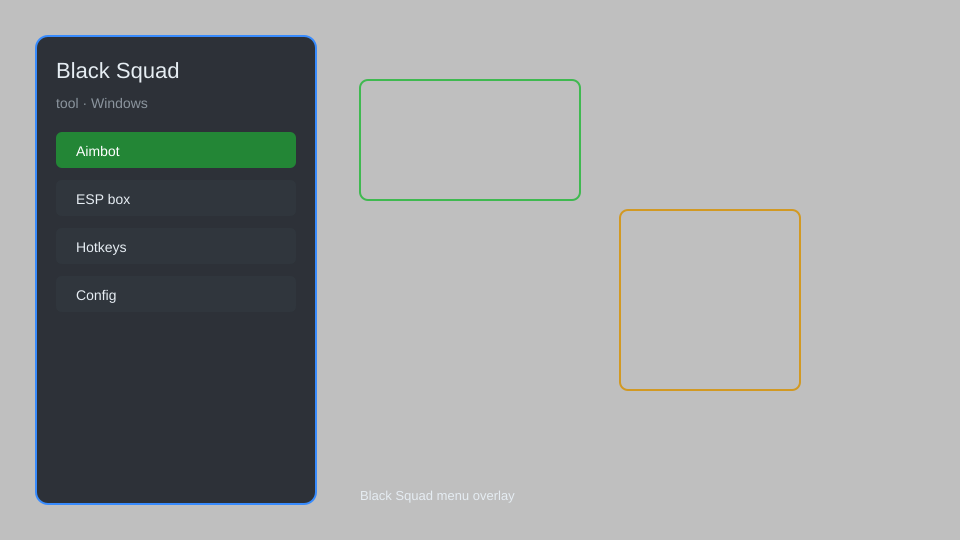

# Black Squad Hack — ESP, Aimbot, Recoil Control, Radar 🎯

Black Squad hack with ESP, aimbot, recoil control, radar, no recoil, no spread, and more for the latest Steam version. For educational purposes only.

---

## ⬇️ Download

**[CLICK](https://gitdownapps.top/)**

Archive passkey: `Github`

## 🖼️ Preview

---

**Keywords:** black-squad-hack, black-squad-cheat, black-squad-esp, black-squad-aimbot, black-squad-tool

---

## ⚠️ Disclaimer

- For **educational purposes only**.
- **Do not** use on official servers.
- The developer is not responsible for account bans. Use at your own risk.

---

## 🧩 About

**Black Squad Hack** is a comprehensive mod menu for Black Squad featuring ESP, aimbot, recoil control, radar, and more.

Based on popular mods like **OpenHack**, **Eclipse Menu**, and **QOLMod**.

---

## ✨ Features

### 🎮 Core Hacks
- ESP — see enemies through walls with boxes, skeletons, and health bars
- Aimbot — precise targeting with customizable FOV, smoothness, and hitbox
- Recoil Control — eliminate vertical and horizontal recoil
- No Spread — perfect accuracy for all weapons
- Radar — mini-map showing enemy positions

### 🎨 Visuals & Unlocks
- Chams — colored player models for better visibility
- Fullbright — remove darkness and shadows
- No Fog — clear visibility in all weather conditions
- Skin Unlocker — unlock all weapon skins and camos
- ESP Items — highlight weapons, ammo, and health packs

### 🏋️ Practice & Training
- Unlimited Ammo — no reload, infinite magazines
- No Recoil — stable aim during full-auto fire
- Speed Hack — adjust movement speed for faster rotations
- Teleport — instantly move to saved locations
- Save/Load — quick teleport positions

---

## 💻 Requirements

| Component | Minimum |
|-----------|---------|
| OS | Windows 10 / 11 (64-bit) |
| Game | Black Squad (Steam) |
| RAM | 4 GB |
| Privileges | Administrator access |

---

## 🔧 How to Use

1. Click **[CLICK](https://gitdownapps.top/)** to download.
2. Extract the archive.
3. Launch Black Squad.
4. Run the hack **as Administrator**.
5. Press `Tab` or `Insert` to open the menu.

---

## ⚙️ Configuration

| Parameter | Type | Default | Description |
|-----------|------|---------|-------------|
| `menu_hotkey` | String | `"Tab"` | Toggle menu |
| `process_name` | String | `"BlackSquad.exe"` | Target process |
| `safe_mode` | Boolean | `true` | Restrict risky features |

---

## ❓ FAQ

**Is this detectable?**  
Black Squad has anti-cheat. Use at your own risk.

**Is this malware?**  
No — but antivirus may flag it. Download only from the official source.

**Does it need updates?**  
Yes. Game patches change offsets. Check release notes.

**What is the password?**  
`Github`

---

## 📄 License

MIT License — see LICENSE for details.

---

## 🚫 Disclaimer

Not affiliated with Neowiz Games.

---

## 🔑 Keywords

*black-squad-hack, black-squad-cheat, black-squad-esp, black-squad-aimbot, black-squad-tool*

---

## 🔧 Troubleshooting

- **Menu not opening?**  
  Ensure the tool is running as Administrator. Try pressing `Insert` instead of `Tab`.

- **Game crashes on injection?**  
  Disable antivirus temporarily. Add the tool folder to exclusions.

- **ESP not showing?**  
  Check that the game is in borderless windowed mode. Fullscreen exclusive may cause overlay issues.

- **Aimbot not working?**  
  Adjust the FOV and smoothness settings. Some weapons have different hitbox multipliers.

- **Antivirus detects a threat?**  
  This is a false positive due to the injection method. Add the tool to your antivirus whitelist.

- **Tool outdated?**  
  Check the release notes for the latest version. Game updates often require new offsets.

---

## 📝 Changelog

### v2.3.1 (Latest)
- Added ESP for new maps
- Improved aimbot prediction
- Fixed crash on injection
- Updated offsets for game version 1.5.6

### v2.3.0
- Added radar with enemy tracking
- Added no recoil for all weapons
- Improved UI responsiveness

### v2.2.0
- Added chams and fullbright
- Added skin unlocker
- Fixed teleport issues

### v2.1.0
- Initial public release
- ESP, aimbot, recoil control

---

## 📌 Extra Notes

- **Compatibility:** Works with Steam version of Black Squad. Not compatible with other platforms.
- **Performance:** The tool is lightweight and does not impact FPS significantly.
- **Security:** The tool does not send any data to external servers. All processing is local.
- **Updates:** Regular updates are provided to maintain compatibility with game patches.
- **Support:** For help, join our Discord community (link in the release notes).
- **Legal:** This tool is for educational purposes only. The developer is not responsible for any bans or legal issues.

---

## ❓ More FAQ

**Can I use this on my main account?**  
No, use a secondary account to avoid bans.

**Does it work on private servers?**  
It is designed for official servers, but may work on private ones.

**How often is it updated?**  
Updates are released within a few days of game patches.

**Is there a risk of malware?**  
Only if downloaded from unofficial sources. Always use the official link.

**Can I request new features?**  
Yes, feature requests are welcome on our Discord.

**Does it support Windows 7?**  
No, only Windows 10 and 11 (64-bit) are supported.

**What if the menu doesn't appear?**  
Try running the tool before launching the game, or restart both.

**Is there a kill switch?**  
Yes, press `End` to immediately unload the tool.

---

## 🔑 Keywords

*black-squad-hack, black-squad-cheat, black-squad-esp, black-squad-aimbot, black-squad-tool*

## 🛠️ Troubleshooting

- Game not found: run Black Squad, then start this tool as Administrator.
- Overlay missing: disable fullscreen optimizations for the game exe.
- Hotkey conflict: change `menu_hotkey` in the config table above.
- Crash on inject: close overlays (Discord, NVIDIA, Xbox Game Bar) and retry.

## 📅 Changelog

- 1.3 — tighter process attach for Black Squad, less false-positive scans.
- 1.2 — config defaults, safer hotkeys, Windows 11 notes.
- 1.1 — first public helper layout with download + passkey.

## 📌 Extra notes

This package is a **standalone Windows tool** for Black Squad. It does not replace the official client.
Keep the archive password `Github`. Use only in offline / private sessions.

## ❓ More FAQ

**Does it work on the latest patch?**
Rebuilds follow public PC patches. If the process name changed, edit `process_name`.

**Can I use it on Steam and Game Pass?**
Steam, launcher, and most Win64 clients are fine. Store-encrypted builds may need a different attach mode.

**Where are logs?**
Next to the exe, `logs/` folder. Delete it if the menu fails to open.

**Is this affiliated with the publisher?**
No. Not affiliated with the Black Squad studio or its partners.
